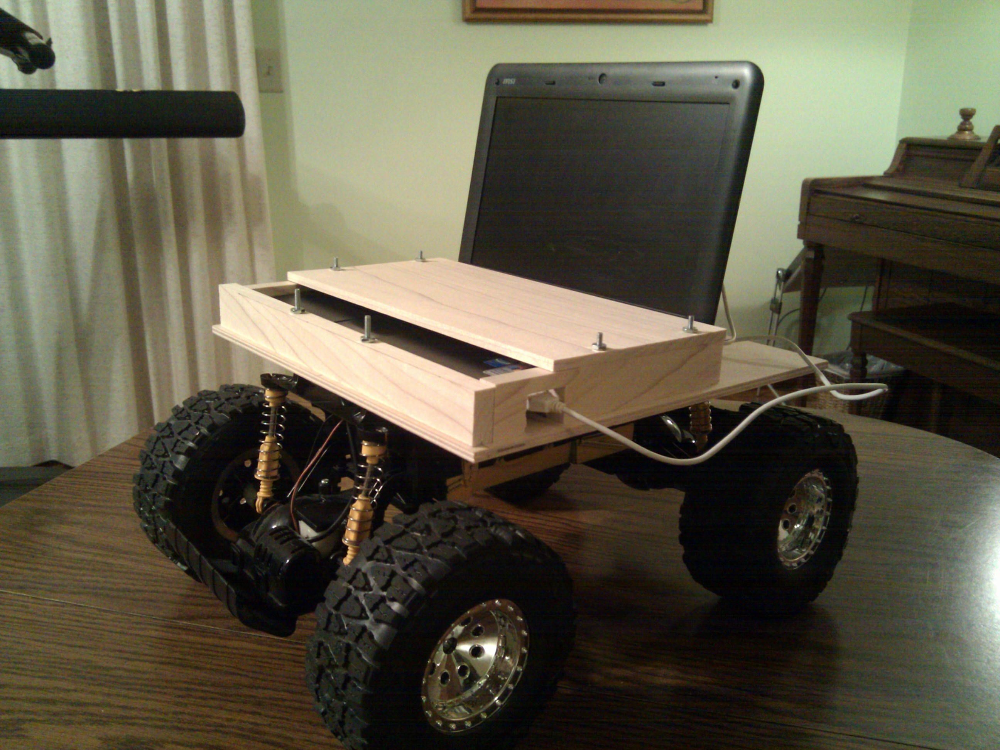

<!--
title: Skype Telepresence Rover
-->
# Skype Telepresence Rover

 *The current prototype.*

While on co-op in California, I often used Skype to video call my family. I even attended my brother's high school graduation virtually via Skype; from a laptop, I chatted with all my old friends from high school and joined in group conversations. People carried me around so I could say hi to everyone at the party. It was a great experience, but I depended on others for mobility. At one point, I was set down facing a wall for 10 minutes until someone noticed and turned me around.

This got me thinking, what would it take to have a real telepresence? A full-blown telepresence robot like an [Anybot](http://anybots.com/) or a [Texai](http://www.willowgarage.com/pages/texai/overview) was out of the question; I'm a college student on a shoe-string budget. But with the shrinking cost of electronics, I was convinced I could make a telepresence robot on a shoestring budget. All I had to do was integrate some existing technology: Skype, a netbook, and an RC car. I estimated I could make a telepresence robot for less than $300!

Part List:
- A netbook with 2GB RAM, acquired from Craigslist for $150
- A $60 RC car from Meijer
- An $30 Arduino microcontroller to connect the laptop to the RC car
- Some wood and screws to mount the laptop and Arduino to the RC car
- Python code (using the Skype API) to send and receive steering and speed commands

<iframe width="560" height="315" src="https://www.youtube.com/embed/QsiM0Cjdzhk" frameborder="0" allowfullscreen></iframe>

*This is from an earlier prototype that was built on a chassis that did not have a built-in motor controller.*

<iframe width="560" height="315" src="https://www.youtube.com/embed/UroWCdb6SUo" frameborder="0" allowfullscreen></iframe>

*For my second prototype, I used a complete electric car chassis, and reverse engineered the built-in motor controller. This video demonstrates applying a 3-5V input causing the wheels to spin, drawing power from the built-in battery, not the voltage source.*

I had hoped to make a video of the robot in action, but have been too distracted to add the joystick control needed to steer the robot properly. In the meanwhile, above are a couple of videos I took during the development of the Skype Rover.

The idea is really simple. The rover has it's own Skype Account. When you call it, it automatically accepts the call and puts your video in full-screen mode so others can see you well. On the controlling end, a Python code lets you send steering and speed commands using the mouse or a joystick, and on the rover end is Python code that receives the commands and sends them through a USB cable to the Arduino, which controls voltages wired into the RC car's motor controller. It is a masterpiece of integration, really. The technologies for telepresence were just there, waiting to be connected with a little bit of solder and Python by some clever individual. If it works, thousands of DIY hobbiests could build one of these things in a weekend.

The project is about 90% complete. Upon my return to UC, I decided I wanted to be able to give tours of the UC Engineering building via the Skype Rover. However, initial tests revealed the engineering building has too many Wi-Fi deadzones to be able to drive the robot down a hallway without disconnecting. I also discovered that the open-loop control combined with latency issues made the rover extremely difficult to drive. Disheartened, I have temporarily shelved the Skype Telepresence Rover in favor of pursuing other projects such as learning ROS, the Robot Operating System from Willow Garage.

After finishing most of the code, I searched for similar projects on the Internet and found [Sparky Jr](http://sparkyjr.ning.com/). Sparky Jr. has a similar goal; however, my rover was less expensive because of the decision to use an RC car chassis and a netbook rather than a Roomba chassis and a Mac mini.