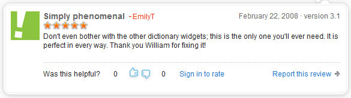
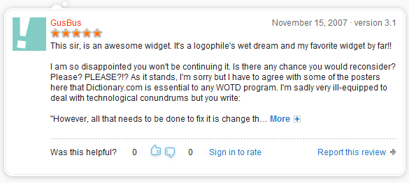
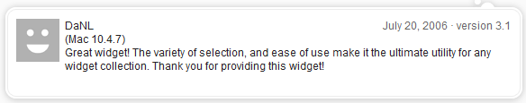

<!--
title: Ultimate Word-of-the-Day
-->
# Ultimate Word-of-the-Day

To help me prepare for the SAT, I wrote a "Word of the Day" desktop widget that consolidated the word-of-the-days from several different websites. (This was before I switched to Linux during my senior year of high school, and when I used Konfabulator (later Yahoo!) Widgets on Windows XP.)

It was a phenomenal success! **My widget received over 20,000 downloads.** No piece of code I have written before or after has spawned so much love and devotion. I do not actively develop it anymore, but I have updated it on occasion when people tell me the dictionary sources are broken. In fact, some of the highest reviews I have gotten have been from people pleading with me to fix the sources because they love this software so much. ~~Last time I checked (2011-11-01), it was still available for download at http://widgets.yahoo.com/widgets/ultimate-wotd/~~ Yahoo! discontinued the Yahoo! Widget platform in March 2012.

 *A screenshot of my widget in the Yahoo! Widget Gallery*

Here are some of the raving reviews people wrote, in reverse chronological order:

The success of this widget has led me to contemplate making a phone app version. However, I am not pursuing that at this time.